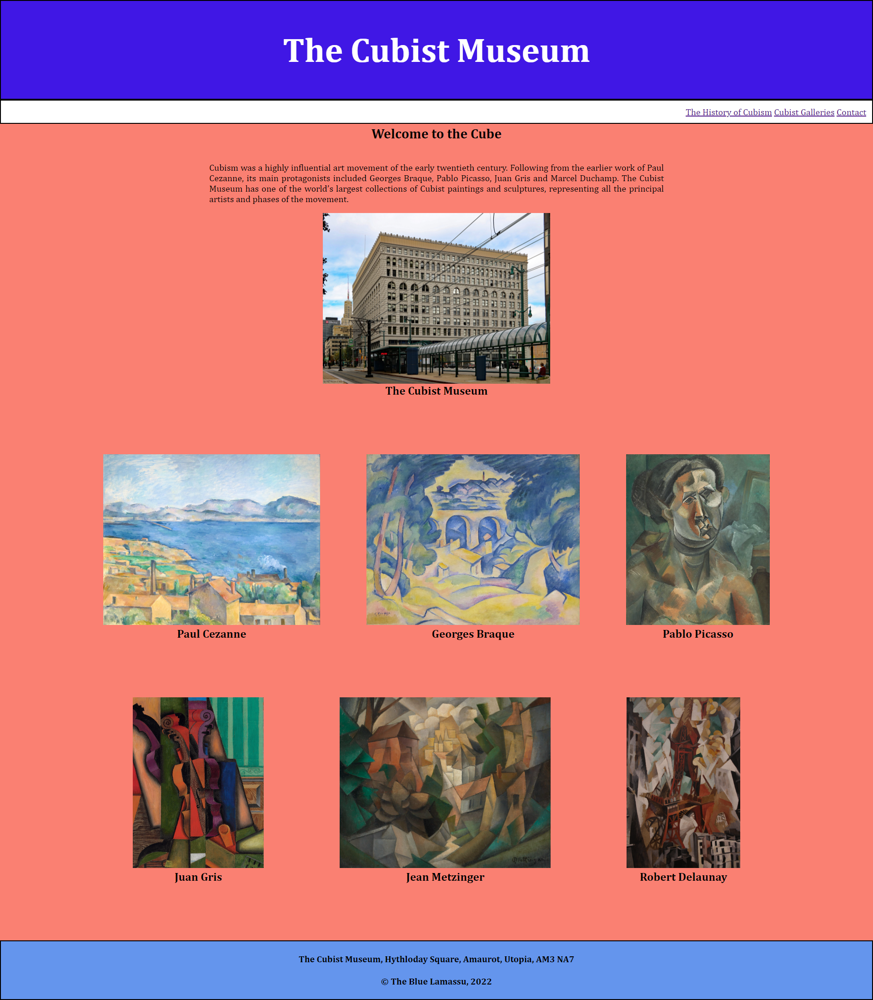

# Cubist-Museum

## Description

The aim of this project was to create a homepage that would be appropriate for an art gallery or museum. The heading and navigation bars are fixed. The gallery section is composed of two flex boxes containing three images each and the footer is a simple text box. Descriptions of all images are provided with alt tags for improved accessibility.

## Installation

N/A

## Usage

N/A

## Credits

N/A

## License

N/A

## https://davidbluelamassu.github.io/Cubist-Museum/

